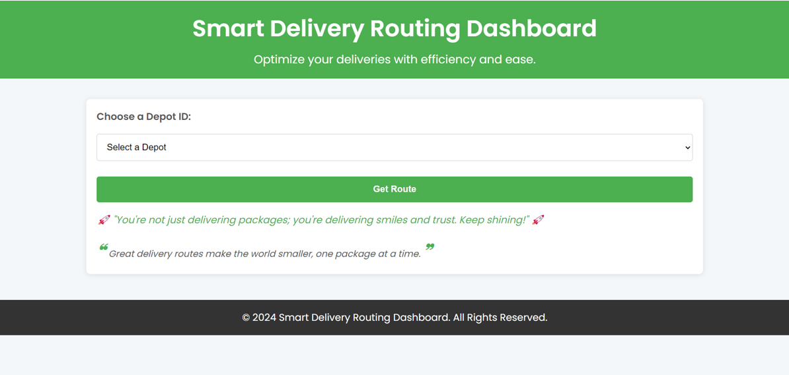
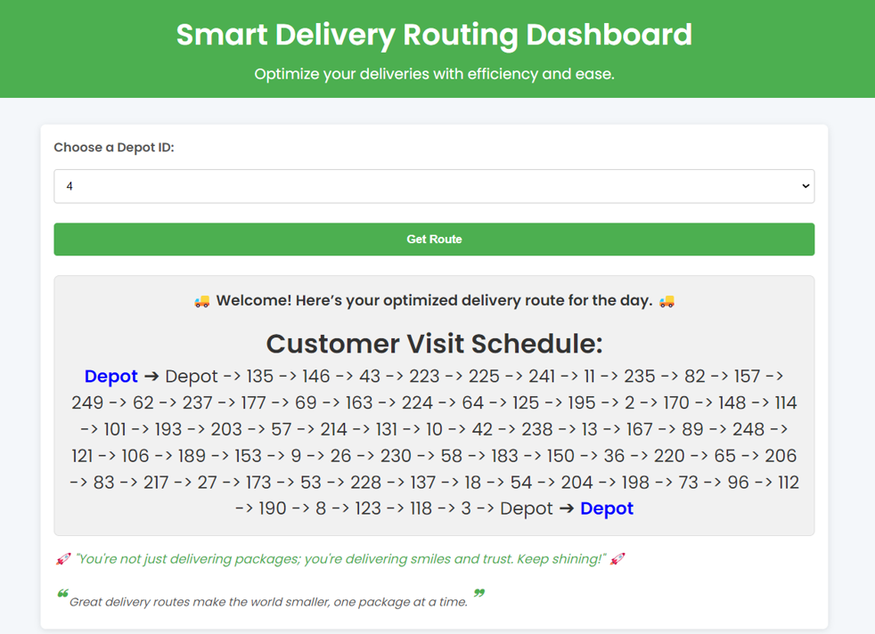
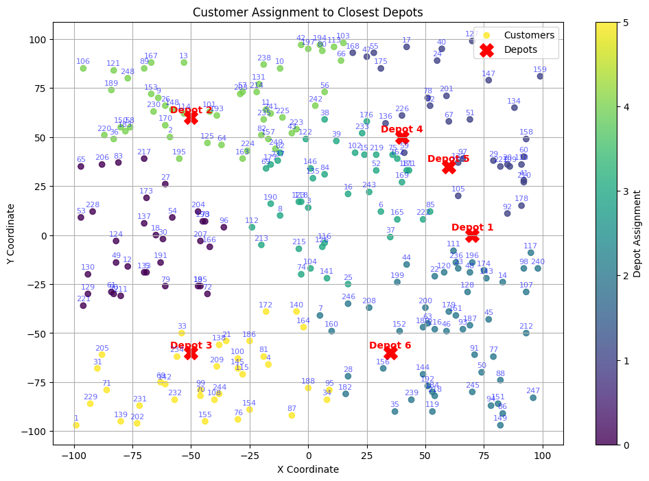
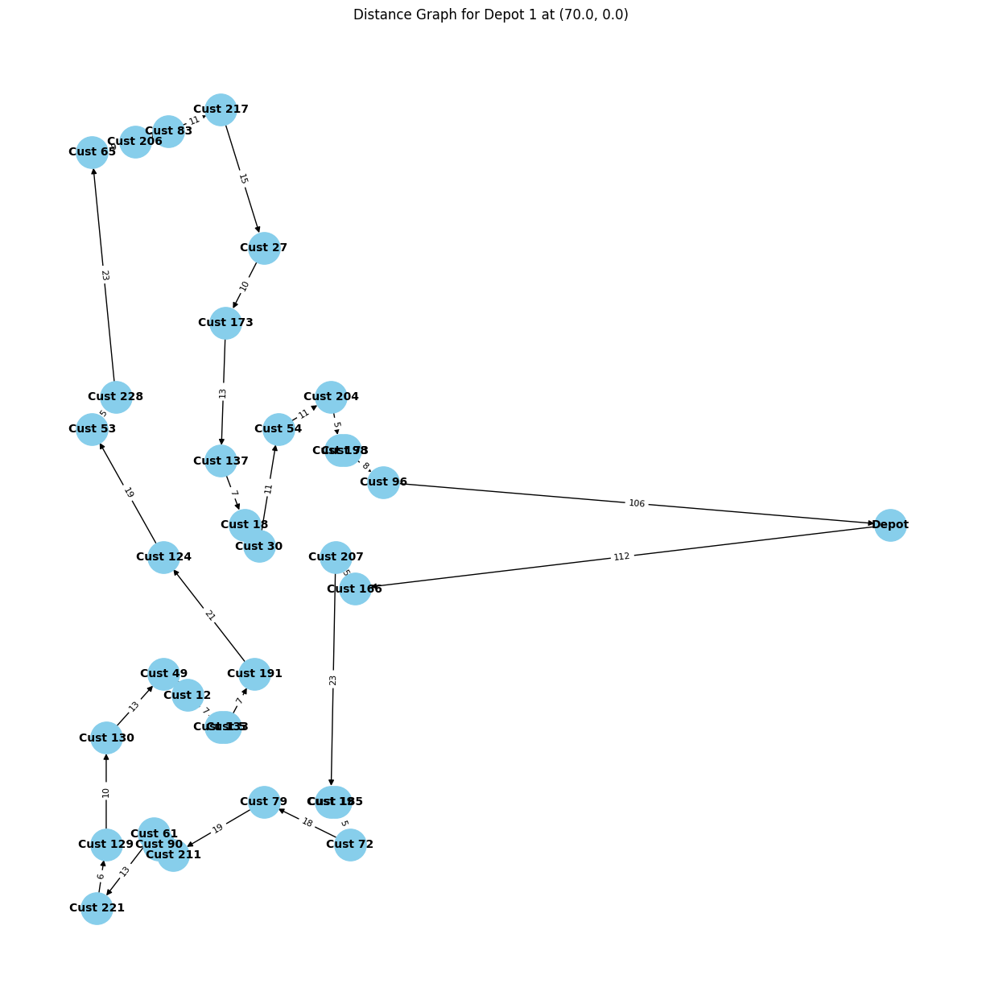

# Vehicle-Routing-Problem-VRP-Optimization-for-Delivery-Services
Optimizing Vehicle Routing for Delivery Services using Advanced Algorithms and a Web Interface

This project focuses on optimizing delivery routes for a fleet of vehicles servicing geographically dispersed customers. The goal is to minimize total travel distance while ensuring each customer is served exactly once, starting and ending at designated depots. A combination of exact and heuristic algorithms is employed to solve the multi-depot VRP efficiently.  

---

## Project Features  
- **Task 1**: Finding the optimal delivery routing and analyzing results.  
- **Task 2**: Developing a web interface for delivery personnel to display optimal paths.  

---

## How to Run the Web Interface with the Optimal Path  

1. **Set up the Database**  
   - Navigate to the VRP folder.  
   - Run `db_setup.py` to create the database, tables, and load data.  

2. **Solve for the Optimal Path**  
   - Run `vrp_solver.py` to calculate the optimal path and save it to the database.  

3. **Launch the Web Interface**  
   - Run `app.py` to access the database and render the HTML files.  
   - Copy the generated link and open it in any browser.  

---

## Statistical Analysis  

For detailed analysis with graphs and plots:  
- Open `OR_Analysis.ipynb`.  

---

## Dataset Information  

The dataset incorporates customer and depot locations, along with the number of depots.  
- **Source**: [Kaggle - Vehicle Routing Problem Dataset](https://www.kaggle.com/datasets/adamjoseph7945/vehicle-routing-problem-set)  

---

## Web Interface
Below are the screenshots of the web interface designed for delivery personnel:

### Web Interface Overview

## Clustering Visualization
The clustering of customers to their respective depots is shown below:

## Optimal Routing for a Depot
An example of an optimal route for Depot 1:

---  

This project provides a comprehensive solution for vehicle routing optimization and integrates seamlessly with a user-friendly web interface for delivery management.  
